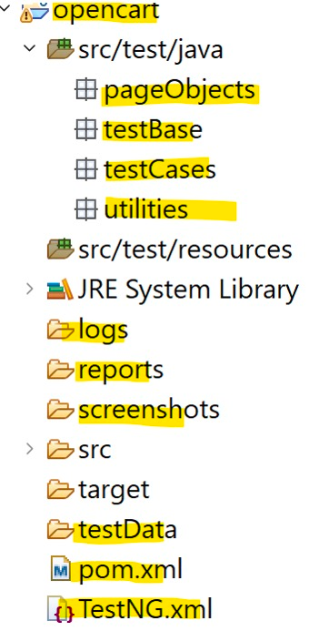

# Test Automation Framework

## This is a test automation framework designed to facilitate the testing of web applications. It provides a structured approach to writing and executing tests, making it easier to maintain and scale your test suite.
### Based on the Page Object Model (POM) design pattern, this framework allows for better organization of test code and promotes reusability of page elements and actions.
### Uses: Java, Selenium, TestNG, and Maven.

### Version 0.0.1
- A blank Java project with the necessary dependencies for Selenium and TestNG.

### Version 0.0.2
- Update pom.xml to include the dependencies.

### Version 0.0.3
- Creating a basic structure for the framework.
- Hybrid Automation framework with POM design pattern.
- Creating a Folder structure for the framework.

