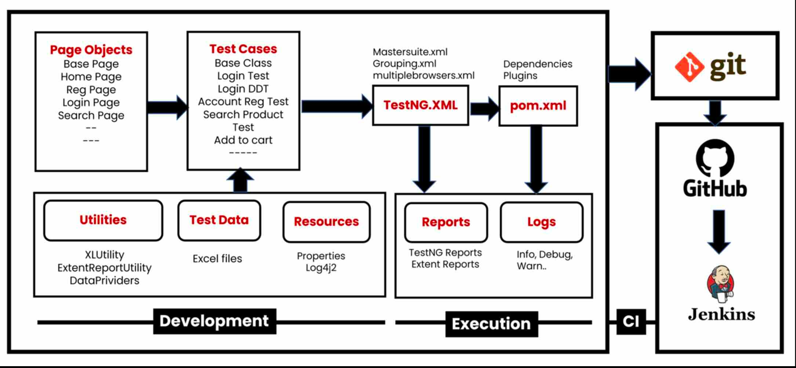
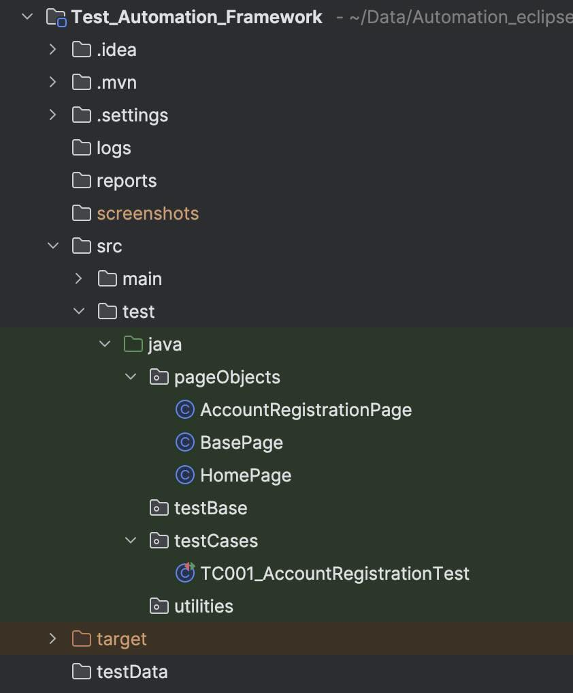

# Test Automation Framework
<hr style="border:1px dotted red;">
<hr style="border:1px dotted red;">


- #### This is a test automation framework designed to facilitate the testing of web applications***OpenCart
- #### It provides a structured approach to writing and executing tests, making it easier to maintain and scale your test suite.
- #### Based on the Page Object Model (POM) design pattern, this framework allows for better organization of test code and promotes reusability of page elements and actions.
- #### Uses: Java, Selenium, TestNG, Maven and Extent Reports.
- #### This project required OpenCart running on localhost using XAMPP or any other server.



<hr style="border:1px dotted red;">

### Version 0.0.1

- A blank Java project with the necessary dependencies for Selenium and TestNG.

<br>
<br>

<hr style="border:1px dotted red;">

### Version 0.0.2

- Update pom.xml to include the dependencies.

<br>
<br>

<hr style="border:1px dotted red;">

### Version 0.0.3

- Creating a basic structure for the framework.
- Hybrid Automation framework with POM design pattern.
- Creating a Folder structure for the framework.
- Create BasePage under "pageObjects" package which will contain only the constructor which will be invoked by every
  page object class constructor.
- Create Page Object Classes for the following pages:
  - HomePage
  - AccountRegistrationPage
- Create AccountRegistrationTest class under "testsCases" package which will contain the test case for account registration.
- Create re-usable methods in BasePage to generate random email.




<br>
<br>

<hr style="border:1px dotted red;">

### Version 0.0.4

Objective of this version is to create a Test case for account registration.
Start by creating Page Objects under the pageObjects package.
We create page objects for the following pages:

- HomePage
- AccountRegistrationPage

**BasePage**

- Serves as a parent class for all page object classes in the project.
- It initializes the WebDriver instance and the web elements on the page using Selenium's PageFactory.
- We have achieved reusability of code by creating a BasePage class.
- Initialize web elements defined in the child classes using PageFactory

<br>
<br>

<hr style="border:1px dotted red;">

### Version 0.0.5
- Modified TC_001_AccountRegistrationTest to use the BasePage class.
- Added a method to generate random string in BasePage.
- Added a method to generate random alphaNumeric string as email in BasePage.
- Ran the test case and verified the account registration functionality.

<br>
<br>

<hr style="border:1px dotted red;">

### Version 0.0.6
- Adding logging functionality to the framework.

Logging - record all the events in the form of text.
Log Levels (6) - ALL < TRACE < DEBUG < INFO < WARN < ERROR < FATAL < OFF

Appenders - appenders are responsible for writing the log messages to a specific destination (Console / File).
Loggers - loggers are responsible for logging the messages.

Add log4j2.xml file to the src/test/resources folder - it is a configuration file.
Start by adding the log4j2 dependency in pom.xml file.
- log4j-core
- log4j-api

Update BaseClass file to include logging functionality.
The configuration should be done in the setup method of BaseClass.


```java
import org.apache.logging.log4j.LogManager;
import org.apache.logging.log4j.Logger;

public class BaseClass {
    public WebDriver driver;
    public Logger logger;
    
    @BeforeClass
    public void setup() {
        logger = LogManager.getLogger(this.getClass());
        driver = new ChromeDriver(); // Initialize ChromeDriver
        driver.get("http://localhost/opencart/upload/index.php"); // Navigate to the application URL
    }
}
```

<br>
<br>

<hr style="border:1px dotted red;">

### Version 0.0.7

Running Test Cases on different browsers
- create a xml file by right clicking on the testCases package and selecting Create TestNG XML.
- Add the following code to the xml file passing parameters for browser and os.
- Save this file as "master.xml" in the project folder (project level).

```xml
<?xml version="1.0" encoding="UTF-8"?>
<!DOCTYPE suite SYSTEM "https://testng.org/testng-1.0.dtd">
<suite name="Suite">
  <test thread-count="3" name="Test">
    <parameter name="os" value="mac" />
    <parameter name="browser" value="chrome" />
    <classes>
      <class name="testCases.TC001_AccountRegistrationTest"/>
    </classes>
  </test>
</suite>
```


- Update the BaseClass setup method to read the parameters from the xml file.
  - add @Parameters annotation to the setup method => @Parameters({"os", "browser"})
  - update the setup method to accept 2 parameters os and browser => public void setup(String os, String browser)


```java
@BeforeClass
@Parameters({"os", "browser"})
public void setup(String os, String br) {

  logger = LogManager.getLogger(this.getClass());

  switch (br) {
    case "chrome":
      driver = new ChromeDriver();
      break;
    case "firefox":
      driver = new FirefoxDriver();
      break;
    case "edge":
      driver = new EdgeDriver();
      break;
    default:
      System.out.println("Browser not supported: " + br);
      return;
  }

  driver.manage().deleteAllCookies();
  driver.manage().window().maximize();
  driver.get("http://localhost/opencart/upload/index.php");
  driver.manage().timeouts().implicitlyWait(Duration.ofSeconds(10));
}
```

- we should now run the test case using only the master.xml file.


<br>
<br>

<hr style="border:1px dotted red;">

### Version 0.0.8
Cross Browser and Parallel Testing.
- create a copy of the master.xml file and name it as "crossbrowsertesting.xml".
- Update the crossbrowsertesting.xml file to include the following code:

```xml
<?xml version="1.0" encoding="UTF-8"?>
<!DOCTYPE suite SYSTEM "https://testng.org/testng-1.0.dtd">
<suite thread-count="3" name="Suite">
    <test name="chrometest">
        <parameter name="os" value="mac" />
        <parameter name="browser" value="chrome" />
        <classes>
            <class name="testCases.TC001_AccountRegistrationTest"/>
        </classes>
    </test>
    <test name="edgetest">
        <parameter name="os" value="mac" />
        <parameter name="browser" value="edge" />
        <classes>
            <class name="testCases.TC001_AccountRegistrationTest"/>
        </classes>
    </test>
    <test name="firefoxtest">
        <parameter name="os" value="mac" />
        <parameter name="browser" value="firefox" />
        <classes>
            <class name="testCases.TC001_AccountRegistrationTest"/>
        </classes>
    </test>
</suite>
```
- run the test case using the crossbrowsertesting.xml file.
- check the console output to see the test cases running in parallel on different browsers.
- check the logs to see the test case execution details.

<br>
<br>

<hr style="border:1px dotted red;">

### Version 0.0.9
Reading common values from a properties file.
- Create a new file named "config.properties" in the src/test/resources folder.
- replace the hardcoded values in the BaseClass setup method (url, username, password).
- add entries in the format of key-value pairs in the config.properties file.
- Add the following properties to the config.properties file:

```properties
appURL=http://localhost/opencart/upload/index.php
email=johndoe_1@gmail.com
password=JohnDoe123
searchProductName=iPhone
```

- Update the BaseClass setup method to read the properties file and use the values from it.

```java
public class BaseClass {

    public WebDriver driver;
    public Logger logger;
    public Properties p;

    @BeforeClass
    @Parameters({"os", "browser"})
    public void setup(String os, String br) throws IOException {

        //FileReader file = new FileReader("./src/test/resources/config.properties");
        FileInputStream file = new FileInputStream("./src/test/resources/config.properties");
        p = new Properties();
        p.load(file);

        logger = LogManager.getLogger(this.getClass());

        switch (br) {
            case "chrome":
                driver = new ChromeDriver();
                break;
            case "firefox":
                driver = new FirefoxDriver();
                break;
            case "edge":
                driver = new EdgeDriver();
                break;
            default:
                System.out.println("Browser not supported: " + br);
                return;
        }

        driver.manage().deleteAllCookies();
        driver.manage().window().maximize();
        driver.get(p.getProperty("appURL"));
        driver.manage().timeouts().implicitlyWait(Duration.ofSeconds(10));
    }

    @AfterClass
    public void tearDown() {
        driver.quit();
    }

    public String randomString() {
        String generatedString = RandomStringUtils.randomAlphabetic(6);
        return generatedString;
    }

    public String randonAlphanumericString() {
        String generatedString = RandomStringUtils.randomAlphabetic(3);
        String generatedNumber = RandomStringUtils.randomNumeric(3);
        return (generatedString + "@" + generatedNumber);
    }

}
```

- Test the changes by running the test case again using master.xml file.


<br>
<br>

<hr style="border:1px dotted red;">